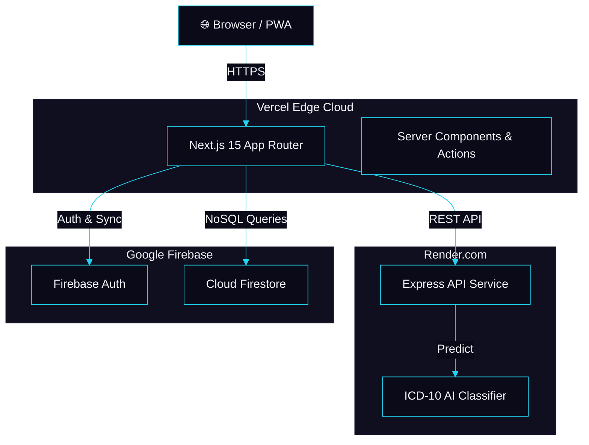
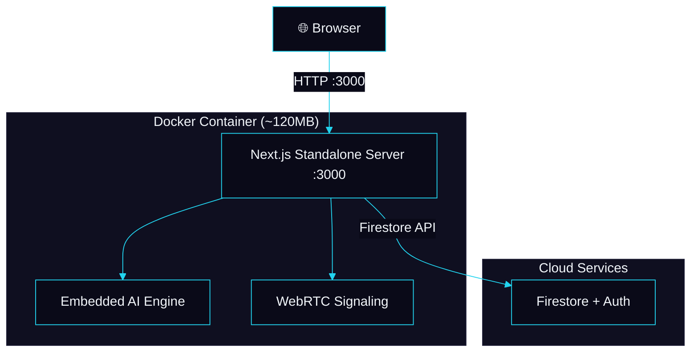

<!-- palette: #22d3ee (clinical teal), #6366f1 (deep indigo), #0a0a18 (dark navy) | theme: clinical-dark healthcare -->

<div align="center">


<a href="https://readme-typing-svg.demolab.com">
  
</a>

<br/>

[](https://nextjs.org)
[](https://firebase.google.com)
[](https://typescriptlang.org)
[](https://docker.com)
[](#-license)

<br/>

[](https://github.com/Shikhar-Kesharwani/nabha-telemedicine/commits/main)
[](https://github.com/Shikhar-Kesharwani/nabha-telemedicine/actions/workflows/lint.yml)
[](https://github.com/Shikhar-Kesharwani/nabha-telemedicine/actions/workflows/test.yml)
[](https://github.com/Shikhar-Kesharwani/nabha-telemedicine)

</div>

---

## 📋 Table of Contents

- [🔭 Overview](#-overview)
- [✨ Key Features](#-key-features)
- [🖥️ Demo](#️-demo)
- [🧬 Tech Stack](#-tech-stack)
- [🏗️ Architecture](#️-architecture)
- [🚀 Getting Started](#-getting-started)
- [⚙️ Environment Variables](#️-environment-variables)
- [📖 Usage](#-usage)
- [📁 Project Structure](#-project-structure)
- [🔌 API Reference](#-api-reference)
- [🐳 Docker Deployment](#-docker-deployment)
- [🧪 Testing & CI/CD](#-testing--cicd)
- [🗺️ Roadmap](#️-roadmap)
- [🤝 Contributing](#-contributing)
- [📄 License](#-license)
- [📬 Contact](#-contact)

---

## 🔭 Overview

Nabha Telemedicine is a full-stack healthcare platform built for underserved and rural communities where specialist access is limited. Patients describe symptoms in plain language, receive AI-powered differential diagnoses mapped to ICD-10 codes, chat with doctors to share prescriptions and medical files, and — only after clinical authorization — connect via peer-to-peer video or voice calls.

The platform runs on a zero-cost infrastructure stack (Vercel + Render + Firebase Spark plan) and ships as a Progressive Web App installable on any device. A fully Dockerized deployment option is included for self-hosted or on-premise environments.

---

## ✨ Key Features

<table>
<tr>
<td width="50%">

**🩺 Clinical Workflow**
- AI symptom checker with ICD-10 differential diagnoses
- Doctor-patient chat with file/prescription sharing
- Pre-consultation authorization (doctor must approve calls)
- Real-time doctor presence tracking via heartbeat system

</td>
<td width="50%">

**📹 Communication**
- Peer-to-peer WebRTC video calls
- Voice calls with STUN signaling
- Voice command navigation (Web Speech API)
- Multi-language support (i18next)

</td>
</tr>
<tr>
<td width="50%">

**🏥 Health Services**
- Appointment booking with calendar & time slots
- Health records vault (upload/view medical documents)
- Nearby pharmacy locator
- Emergency ambulance finder
- Medicine search & subscription tracking

</td>
<td width="50%">

**⚡ Platform**
- Progressive Web App (installable, offline-capable)
- Dark-first glassmorphic UI with Framer Motion animations
- Dual deployment: cloud microservices or single Docker container
- Doctor portal with dedicated dashboard & call management

</td>
</tr>
</table>

---

## 🖥️ Demo

<!-- TODO: Add live deployment URL once Vercel build is confirmed working -->
<!-- TODO: Add screenshots or GIF walkthrough of the main patient flow -->

> **Note:** The application runs locally on `http://localhost:3000` after setup. See [Getting Started](#-getting-started) below.

---

## 🧬 Tech Stack

<div align="center">


</div>

<br/>

| Layer | Technology | Purpose |
| :---: | :--- | :--- |
| 🖼️ | **Next.js 15** (App Router, Server Actions, Standalone) | SSR/SSG frontend with React Server Components |
| 🎨 | **Tailwind CSS 3** + **Radix UI / Shadcn** | Design system with 35+ accessible primitives |
| 🎬 | **Framer Motion** | Page transitions and micro-animations |
| 📊 | **Recharts** | Dashboard health analytics charts |
| 🔐 | **Firebase Auth** | Email/password patient & doctor authentication |
| 🗄️ | **Cloud Firestore** | Real-time NoSQL database for all clinical data |
| 🤖 | **Custom ICD-10 AI Classifier** | 100+ disease dataset with tokenization & bigram matching |
| 🧠 | **Google Genkit AI** | Extended AI capabilities via Gemini models |
| 🌐 | **Express.js** | Backend microservice hosting AI predict API |
| 📹 | **WebRTC** + **BroadcastChannel API** | Peer-to-peer video/voice with tab-local signaling |
| 🌍 | **i18next** | Multi-language internationalization |
| 📱 | **@ducanh2912/next-pwa** | Service worker for PWA install & offline support |
| 🐳 | **Docker** (multi-stage Alpine) | ~120MB production container |
| ☁️ | **Vercel + Render + Firebase** | Zero-cost cloud deployment |

---

## 🏗️ Architecture

The platform supports two production deployment architectures:

### Architecture 1 — Decoupled Cloud (Vercel + Render + Firebase)



### Architecture 2 — Dockerized Self-Hosted



---

## 🚀 Getting Started

### Prerequisites

| Tool | Version | Check |
| :--- | :--- | :--- |
| Node.js | ≥ 20.x | `node -v` |
| npm | ≥ 10.x | `npm -v` |
| Git | Any | `git --version` |
| Docker *(optional)* | ≥ 24.x | `docker -v` |

### Installation

```bash
# 1. Clone the repository
git clone https://github.com/Shikhar-Kesharwani/nabha-telemedicine.git
cd nabha-telemedicine

# 2. Install frontend dependencies
npm install

# 3. Install backend dependencies
cd backend && npm install && cd ..

# 4. Configure environment variables
cp .env.example .env.local
# Edit .env.local with your Firebase keys (see table below)

# 5. Start the development server
npm run dev
```

The app will be running at **`http://localhost:3000`**.

To run the backend AI API separately:

```bash
cd backend
PORT=5001 npm start
# Health check: http://localhost:5001/api/health
```

---

## ⚙️ Environment Variables

Create a `.env.local` file in the project root:

| Variable | Description | Required | Example |
| :--- | :--- | :---: | :--- |
| `NEXT_PUBLIC_FIREBASE_API_KEY` | Firebase project API key | ✅ | `AIzaSy...` |
| `NEXT_PUBLIC_FIREBASE_AUTH_DOMAIN` | Firebase auth domain | ✅ | `myproject.firebaseapp.com` |
| `NEXT_PUBLIC_FIREBASE_PROJECT_ID` | Firebase project ID | ✅ | `myproject-12345` |
| `NEXT_PUBLIC_FIREBASE_STORAGE_BUCKET` | Firebase storage bucket | ✅ | `myproject.firebasestorage.app` |
| `NEXT_PUBLIC_FIREBASE_MESSAGING_SENDER_ID` | Firebase messaging sender ID | ✅ | `785178165441` |
| `NEXT_PUBLIC_FIREBASE_APP_ID` | Firebase app ID | ✅ | `1:785178...:web:484617...` |
| `NEXT_PUBLIC_RENDER_BACKEND_URL` | Render backend URL | ❌ | `https://my-backend.onrender.com` |

> **Note:** If `NEXT_PUBLIC_RENDER_BACKEND_URL` is not set, the symptom checker falls back to the embedded local AI model automatically.

---

## 📖 Usage

### Patient Flow

1. **Register/Login** → Create account with email and password
2. **Symptom Check** → Describe symptoms in plain language → receive AI differential diagnoses with ICD-10 codes, urgency level, and specialist recommendation
3. **Chat with Doctor** → Select a doctor → send messages, prescriptions, and medical files
4. **Request Call** → After doctor reviews and grants permission → video or voice call buttons unlock
5. **Book Appointment** → Select date, time slot, and payment method
6. **Health Records** → Upload and manage medical documents

### Doctor Flow

1. **Doctor Login** → Access dedicated doctor dashboard at `/doctor/dashboard`
2. **Review Patients** → See incoming chat requests and patient histories
3. **Grant Call Permission** → Authorize video/voice call access per patient
4. **Accept Calls** → Handle video calls at `/doctor/video-call/[patientId]`

---

## 📁 Project Structure

```
nabha-telemedicine/
├── backend/                    # Express.js microservice
│   ├── server.js               # AI classifier API + health endpoint
│   ├── Dockerfile              # Backend container config
│   ├── render.yaml             # Render.com deployment blueprint
│   └── package.json
├── src/
│   ├── app/
│   │   ├── (app)/              # Patient-facing authenticated routes
│   │   │   ├── dashboard/      # Patient dashboard with vitals & charts
│   │   │   ├── appointments/   # Booking flow with calendar & payments
│   │   │   ├── doctor-chat/    # Real-time chat + file sharing
│   │   │   ├── video-call/     # WebRTC peer-to-peer video
│   │   │   ├── voice-call/     # WebRTC voice calls
│   │   │   ├── symptom-checker/# AI diagnostic tool
│   │   │   ├── health-records/ # Medical document vault
│   │   │   ├── medicine-finder/# Drug search & subscriptions
│   │   │   ├── pharmacy-locator/# Nearby pharmacy map
│   │   │   └── ambulance-nearby/# Emergency services locator
│   │   ├── doctor/             # Doctor portal routes
│   │   │   ├── dashboard/      # Doctor queue + call permissions
│   │   │   ├── video-call/     # Doctor-side video interface
│   │   │   └── voice-call/     # Doctor-side voice interface
│   │   ├── (auth)/             # Login/register layouts
│   │   └── api/health/         # App health check endpoint
│   ├── components/
│   │   ├── ui/                 # 35 Shadcn/Radix primitives
│   │   ├── voice-command-button.tsx
│   │   └── doctor-call-modal.tsx
│   └── lib/
│       ├── services/           # Domain services layer
│       │   ├── doctor-presence.ts    # Heartbeat online tracking
│       │   ├── call-permissions.ts   # Pre-consult authorization
│       │   ├── call-signaling.ts     # WebRTC signaling
│       │   ├── chat.ts               # Chat messaging
│       │   ├── appointments.ts       # Booking management
│       │   └── health-records.ts     # Document storage
│       ├── firebase.ts         # Firebase SDK initialization
│       └── i18n.ts             # Internationalization config
├── Dockerfile                  # Multi-stage production container
├── docker-compose.yml          # Container orchestration
├── .github/workflows/          # CI/CD pipelines
│   ├── lint.yml
│   ├── test.yml
│   ├── security.yml
│   ├── deploy-vercel.yml
│   ├── deploy-cloudrun.yml
│   └── release.yml
└── next.config.ts              # Next.js + PWA configuration
```

---

## 🔌 API Reference

### Backend Express API (`/backend`)

| Method | Endpoint | Description | Request Body |
| :---: | :--- | :--- | :--- |
| `GET` | `/api/health` | Service health check | — |
| `POST` | `/api/ai/predict` | AI symptom analysis | `{ "symptoms": "chest pain and shortness of breath" }` |

<details>
<summary><strong>Example Response — <code>/api/ai/predict</code></strong></summary>

```json
{
  "urgency": "Immediate Medical Attention",
  "specialistType": "Cardiologist",
  "differentialDiagnoses": [
    {
      "condition": "Acute Coronary Syndrome / Angina Pectoris",
      "confidencePercentage": 98,
      "explanation": "Symptom vector matches acute myocardial ischemia parameters...",
      "icdCode": "I20.9"
    },
    {
      "condition": "Essential Primary Hypertension",
      "confidencePercentage": 45,
      "explanation": "Vascular pressure indicators consistent with stage 1...",
      "icdCode": "I10"
    }
  ],
  "homeRemedies": [
    "Sit upright and rest immediately",
    "Call 108 Emergency Ambulance",
    "Avoid any physical exertion"
  ],
  "disclaimer": "Generated by Dataset-Trained Medical AI Classifier (ICD-10 Mapped)."
}
```

</details>

### Frontend API Route

| Method | Endpoint | Description |
| :---: | :--- | :--- |
| `GET` | `/api/health` | Next.js app health check |

---

## 🐳 Docker Deployment

### Option A — Docker Compose (Recommended)

```bash
git clone https://github.com/Shikhar-Kesharwani/nabha-telemedicine.git
cd nabha-telemedicine

# Build and launch in detached mode
docker-compose up -d --build

# Verify
docker-compose ps
docker-compose logs -f
```

### Option B — Direct Docker Build

```bash
docker build -t nabha-telemedicine:latest .

docker run -d \
  --name nabha_app \
  -p 3000:3000 \
  --restart unless-stopped \
  -e NODE_ENV=production \
  nabha-telemedicine:latest
```

The container runs a non-root `nextjs` user (UID 1001) with automatic health checks every 30 seconds.

---

## 🧪 Testing & CI/CD

The repository includes six GitHub Actions workflows:

| Workflow | File | Trigger |
| :--- | :--- | :--- |
| Lint | `.github/workflows/lint.yml` | Push / PR |
| Tests | `.github/workflows/test.yml` | Push / PR |
| Security | `.github/workflows/security.yml` | Push / PR |
| Deploy Vercel | `.github/workflows/deploy-vercel.yml` | Push to `main` |
| Deploy Cloud Run | `.github/workflows/deploy-cloudrun.yml` | Push to `main` |
| Release | `.github/workflows/release.yml` | Tag push |

```bash
# Run lint locally
npm run lint

# Type check
npx tsc --noEmit

# Build production bundle
npm run build
```

---

## 🗺️ Roadmap

- [x] AI symptom checker with ICD-10 mapping
- [x] Real-time doctor-patient chat with file sharing
- [x] Pre-consultation authorization workflow
- [x] WebRTC video and voice calls
- [x] Doctor presence heartbeat tracking
- [x] PWA support (installable, offline-capable)
- [x] Dual deployment architecture (Cloud + Docker)
- [ ] End-to-end encryption for chat messages
- [ ] Push notifications for appointment reminders
- [ ] Multi-language UI translations (Hindi, Punjabi)
- [ ] Integration with government health APIs (ABHA/Ayushman Bharat)
- [ ] Stripe/Razorpay payment gateway integration

---

## 🤝 Contributing

Contributions are welcome! Here's how to get started:

1. Fork the repository
2. Create a feature branch (`git checkout -b feature/amazing-feature`)
3. Commit your changes (`git commit -m 'Add amazing feature'`)
4. Push to the branch (`git push origin feature/amazing-feature`)
5. Open a Pull Request

> **Warning:** Never commit `.env` files or Firebase API keys. The repository has GitHub Secret Scanning enabled and will block pushes containing secrets.

---

## 📄 License

<!-- TODO: Add a LICENSE file to the repository. Recommended: MIT License -->

This project is available for use. See the repository for details.

---

## 📬 Contact

**Shikhar Kesharwani** — Project Maintainer

- GitHub: [@Shikhar-Kesharwani](https://github.com/Shikhar-Kesharwani)
- Repository: [nabha-telemedicine](https://github.com/Shikhar-Kesharwani/nabha-telemedicine)

---

<div align="center">


<br/>

**If this project helped you, consider giving it a ⭐**

<a href="https://github.com/Shikhar-Kesharwani/nabha-telemedicine">
  
</a>

<br/><br/>

<sub>Built with care for communities that need healthcare the most.</sub>

</div>
