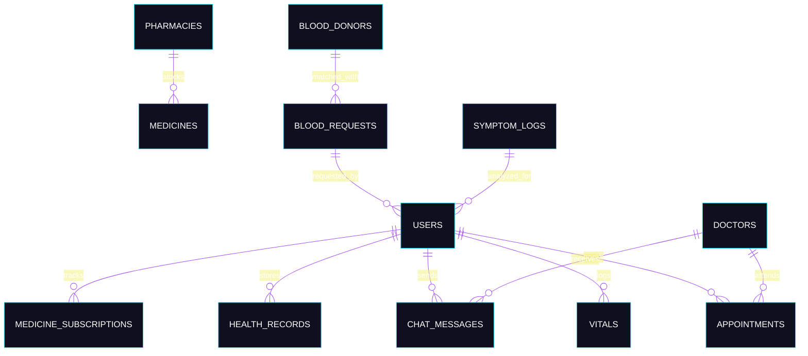
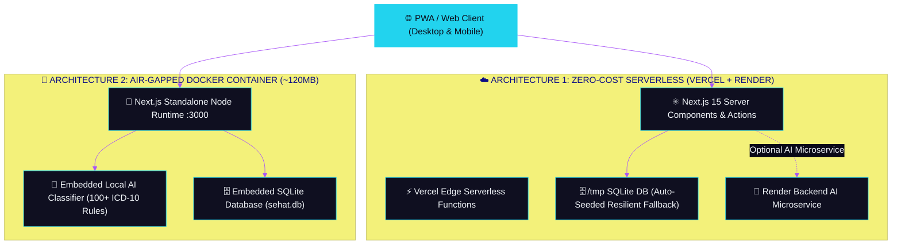

<!-- palette: #22d3ee (clinical teal), #6366f1 (deep indigo), #a855f7 (violet), #0a0a18 (dark navy) | theme: clinical-dark-3d healthcare -->

<div align="center">

<!-- ═══════════════════════════════════════════════════════════════════ -->
<!-- HERO SECTION — Official Nabha Platform Graphic Banner -->
<!-- ═══════════════════════════════════════════════════════════════════ -->


<br/>

<!-- Animated typing tagline -->
<a href="https://github.com/Shikhar-Kesharwani/nabha-telemedicine">
  
</a>

<br/>

<a href="https://github.com/Shikhar-Kesharwani/nabha-telemedicine">
  
</a>

<br/><br/>

<!-- ═══════════════════════ BADGE CONSTELLATION ═══════════════════════ -->

<!-- Row 1: Core tech badges -->
<a href="https://nextjs.org"></a>

<a href="https://typescriptlang.org"></a>

<a href="https://vitest.dev"></a>

<a href="https://sqlite.org"></a>

<a href="https://docker.com"></a>

<br/><br/>

<!-- Row 2: Status & Quality badges -->
[-22c55e?style=flat-square&logo=vitest&logoColor=white)](https://github.com/Shikhar-Kesharwani/nabha-telemedicine)
[](https://github.com/Shikhar-Kesharwani/nabha-telemedicine)
[](https://github.com/Shikhar-Kesharwani/nabha-telemedicine)
[](https://github.com/Shikhar-Kesharwani/nabha-telemedicine)
[](LICENSE)
[](https://github.com/Shikhar-Kesharwani/nabha-telemedicine/commits/main)

<br/>

<!-- Row 3: Differentiated rural health pills -->


</div>

<br/>

<!-- ═══════════════════════════════════════════════════════════════════ -->
<!-- VISUAL DIVIDER -->
<!-- ═══════════════════════════════════════════════════════════════════ -->


<br/>

<!-- ═══════════════════════════════════════════════════════════════════ -->
<!-- TABLE OF CONTENTS -->
<!-- ═══════════════════════════════════════════════════════════════════ -->

<div align="center">

### 🧭 Table of Contents

[`🔭 Overview`](#-overview)
[`🎯 Recruiter Quick Demo`](#-recruiter--evaluator-quick-demo)
[`🌾 7 Rural Health Innovations`](#-7-flagship-rural-health-innovations)
[`✨ Core Platform Features`](#-core-telemedicine-features)
[`🧬 Tech Stack & DB`](#-tech-stack--database-architecture)
[`🏗️ System Architecture`](#-system-architecture)
[`🚀 Quick Start`](#-getting-started)
[`🧪 Test Suite & CI/CD`](#-testing--quality-gates)
[`📁 Project Structure`](#-project-structure)
[`🗺️ Roadmap`](#-roadmap)
[`📄 License`](#-license)

</div>

<br/>


<br/>

## 🔭 Overview

<table>
<tr>
<td>

**Nabha Telemedicine** is a high-performance, full-stack digital health platform engineered specifically to address the acute healthcare delivery disparities of **Nabha Tehsil (Patiala District, Punjab)** and agrarian communities across Northern India.

Unlike generic telemedicine clones, this platform is deeply rooted in local socio-epidemiological realities:
- **Catastrophic Out-of-Pocket Medicine Costs**: Solved through automated **Prescription OCR & Jan Aushadhi generic mapping**, cutting pharmaceutical expenses by 50%–85% with certified Kendra stock verification in Nabha.
- **Occupational Agrochemical Hazards**: First-of-its-kind **Pesticide Toxicity Risk Calculator** and **ICD-10 T60 Emergency Toxicology Protocol** (decontamination guidelines, zero-emesis warnings, and 24/7 Atropine/PAM antidote tracking at Civil Hospital Nabha & Rajindra Hospital Patiala).
- **Under-Enrolment in Public Entitlements**: A 60-second **Punjab Government Scheme Eligibility Engine** screening families for Ayushman Bharat MMSBY (₹5 Lakh cashless), BPSSBY, Free Hepatitis C Treatment, and Free Hemodialysis.
- **Urgent Transfusion Shortages**: A hyper-local **Emergency Blood Request & ABO/Rh Volunteer Donor Directory** with immediate compatibility cross-matching.
- **Language & Literacy Barriers**: **Sehat Sahayak AI Assistant** providing natural voice and text guidance in **Punjabi (Gurmukhi)**, Hindi, and English.
- **Clinical Safety**: Doctor-controlled **WebRTC peer-to-peer encrypted consultations**, where video/voice sessions are strictly unlocked only after clinical review of the patient's case and symptoms.

</td>
</tr>
</table>

<br/>

<!-- ═══════════════════════════════════════════════════════════════════ -->
<!-- RECRUITER DEMO SECTION -->
<!-- ═══════════════════════════════════════════════════════════════════ -->

## 🎯 Recruiter & Evaluator Quick Demo

The app includes a **1-Click Persona Switcher** built directly into the UI (floating bottom-right pill) — zero registration or passwords required:

<div align="center">

| Persona | Name | Role | Direct Route | Key Flows to Test |
| :--- | :--- | :--- | :---: | :--- |
| 🧑‍💼 **Patient** | Harjinder Singh | Rural Citizen, Model Town Nabha | `/dashboard` | • Epidemiological Outbreak Surveillance Banner<br/>• Photoplethysmography pulse scanning & ACC/AHA vitals<br/>• Prescription generic conversion & cost comparison |
| 👨‍⚕️ **Doctor** | Dr. Gurpreet Singh, MD | Cardiologist, Rajindra Hospital Patiala | `/doctor/dashboard` | • Live consultation queue & triage badges<br/>• Clinical call permission authorization gate<br/>• Digital prescription generator & clinical notes |

</div>

### 🚀 60-Second Feature Tour Checklist

```markdown
1. 📸 /prescription-scanner   → Click "Load Sample Rx" → Click "Convert to Jan Aushadhi" → See ₹1,200+ savings breakdown
2. 🌾 /health-index           → Adjust spray hours slider & toggles → Observe live toxicity risk score & Malwa CKDu guide
3. 📜 /scheme-checker         → Select "Blue Card" & "J-Form Farmer" → Instant qualification for ₹5L MMSBY & BPSSBY
4. 🩸 /blood-request          → Filter by "O-" or "B+" → Inspect donor registry & click "Request Blood Now" modal
5. 💬 Sehat Sahayak AI        → Click floating pill (bottom-left) → Click "ਸਿਵਲ ਹਸਪਤਾਲ ਨਾਭਾ ਓਪੀਡੀ ਸਮਾਂ?" → Read instant routing
6. 🚨 /symptom-checker        → Type "pesticide spray headache blurred vision" → See critical Atropine antidote emergency directive
7. 📊 /dashboard              → Review active Nabha block Dengue outbreak alert & 7-day disease surveillance aggregate
```

<br/>


<br/>

## 🌾 7 Flagship Rural Health Innovations

These 7 specialized features address the direct public health challenges of rural Punjab, setting this system apart from conventional telemedicine platforms:

<div align="center">

<table>
<tr>
<td width="50%">

### 1. 📸 Prescription OCR & Jan Aushadhi Matcher (`/prescription-scanner`)
- **Clinical Problem**: Rural families spend up to 60% of their healthcare budget on branded medicines prescribed by private clinics.
- **Solution**: Upload a handwritten or printed prescription photo (or paste text).
- **Engine**: Parses drug names, strengths, and dosages; maps them to certified **Pradhan Mantri Bhartiya Janaushadhi Pariyojana (PMBJP)** generic molecules.
- **Impact**: Computes itemized rupee savings (70%–85% cheaper) and displays stock availability at **Civil Hospital Gate Kendra, Nabha**.

</td>
<td width="50%">

### 2. 📜 Punjab Government Scheme Checker (`/scheme-checker`)
- **Clinical Problem**: Thousands of eligible Punjab families pay out-of-pocket due to lack of scheme awareness.
- **Solution**: 60-second assessment screening against **Punjab State Health Agency (SHA)** criteria.
- **Covered Schemes**:
  1. *Ayushman Bharat MMSBY* (₹5,00,000 cashless)
  2. *Bhagat Puran Singh Sehat Bima Yojana (BPSSBY)*
  3. *Mukh Mantri Punjab Hepatitis-C Relief Fund* (100% Free DAA Cure)
  4. *Pradhan Mantri Free Dialysis Programme*
  5. *Janani Shishu Suraksha Karyakram (JSSK)*
  6. *PMBJP Generic Drug Subsidy*

</td>
</tr>

<tr>
<td width="50%">

### 3. 🩸 Hyper-Local Blood Request & Donor Network (`/blood-request`)
- **Clinical Problem**: Patients at Sub-Divisional Hospital Nabha frequently face delays for emergency cross-matching or component availability.
- **Solution**: Real-time broadcast system for emergency PRBC/FFP units with urgency tiers (`CRITICAL` <2h, `URGENT` same day).
- **Transfusion Matrix**: Full red-cell compatibility matching engine (universal O- donor, universal AB+ recipient rules).
- **Integration**: Direct hotlines to Civil Hospital Nabha Blood Storage Unit and Rajindra Hospital Patiala Blood Bank.

</td>
<td width="50%">

### 4. 🌾 Farmer & Community Health Index (`/health-index`)
- **Clinical Problem**: Punjab's Malwa belt faces disproportionate rates of chemical toxicity, chronic kidney disease (CKDu), and stubble-smoke asthma.
- **Interactive Calculator**: Live toxicity score based on crop type (Cotton/Paddy), equipment (Knapsack vs Boom), spray hours, and PPE gear.
- **Clinical Advisory**: Groundwater heavy-metal & TDS mitigation, free SDH Nabha hemodialysis referrals, and seasonal stubble smoke (parali) N95 protection.
- **Epidemiological Graph**: 12-month Recharts seasonal cycle covering vector-borne, respiratory, and agrochemical peaks.

</td>
</tr>

<tr>
<td width="50%">

### 5. 🗣️ Sehat Sahayak AI Assistant (Floating Bot)
- **Clinical Problem**: Non-English literate patients struggle to navigate complex digital portals.
- **Solution**: Conversational health navigator supporting **Punjabi (Gurmukhi)**, Hindi, and English with Web Speech recognition (`pa-IN`).
- **Contextual Routing**: Recognizes local healthcare queries (OPD times, Jan Aushadhi, fever triage, pesticide antidote, blood requests) and routes users to the exact platform flow.

</td>
<td width="50%">

### 6. 🚨 Agrochemical Poisoning Protocol (`/symptom-checker`)
- **Clinical Problem**: Accidental ingestion or skin absorption of organophosphates during crop spraying requires immediate intervention.
- **Emergency Directive**: Auto-triggers on symptoms matching chemical poisoning.
- **Safety Rules**: Explicit warnings: **DO NOT INDUCE VOMITING** (prevents fatal aspiration), 15-minute flush decontamination guidelines, direct 108 ambulance dispatch, and Atropine antidote supply confirmation at Nabha Civil Hospital.

</td>
</tr>

<tr>
<td colspan="2">

### 7. 📊 Nabha Block Epidemiological Outbreak Surveillance Bulletin (Dashboard Banner)
- **Clinical Problem**: Vector-borne and waterborne disease outbreaks (Dengue, Typhoid, Malaria) spread undetected before official district bulletins.
- **Solution**: Automatically logs anonymized symptom checker queries into SQLite (`symptom_logs`).
- **Cluster Detection**: 7-day rolling window calculates case thresholds (flags clusters as `OUTBREAK_WATCH` or `HIGH_ALERT`).
- **Public Health Banner**: Renders live on patient dashboards with primary threat warnings, active hotspots (Patiala Gate, Model Town, Bhadson Road), and direct links to Civil Hospital Nabha Fever Clinic.

</td>
</tr>
</table>

</div>

<br/>


<br/>

## ✨ Core Telemedicine Features

In addition to rural health innovations, the platform offers a comprehensive clinical consultation suite:

<table>
<tr>
<td width="33%" align="center">


**Dual-Engine Symptom Classifier**
Dataset-trained model mapping 100+ conditions to **ICD-10 clinical codes**, triage urgency tiers, differential percentages, and specialist routing.

</td>
<td width="33%" align="center">


**Encrypted WebRTC Audio/Video**
Peer-to-peer media streaming with STUN negotiation, camera/mic toggling, track teardown on hangup, and cross-tab signaling.

</td>
<td width="33%" align="center">


**Clinical Permission Gate**
Patients cannot initiate calls unsolicited. Doctors review incoming chats and grant permissions before calls are enabled.

</td>
</tr>
<tr>
<td width="33%" align="center">


**Pre-Consultation Messaging**
Real-time chat with base64 attachment support for diagnostic lab reports, previous prescriptions, and clinical photos.

</td>
<td width="33%" align="center">


**ACC/AHA Vitals Monitoring**
Optical pulse simulation, blood pressure stage classification, blood glucose, and SpO2 tracking saved to SQLite.

</td>
<td width="33%" align="center">


**Progressive Web App**
Installable manifest with service worker caching, zero mobile store overhead, and offline resilience for rural 3G/4G networks.

</td>
</tr>
</table>

<br/>


<br/>

## 🧬 Tech Stack & Database Architecture

### Technology Matrix

<div align="center">

| Layer | Technology | Specification / Version | Purpose |
| :--- | :--- | :---: | :--- |
| **Framework** | Next.js (App Router) | `15.3.8` (React 18.3) | Server Components, Server Actions, Dynamic Layouts |
| **Language** | TypeScript | `5.x` (Strict Mode) | Full type-safety across client, actions, and test suites |
| **Styling** | Tailwind CSS + CSS Variables | `3.4` | Dark clinical 3D aesthetic, accessible contrast ratios |
| **Motion** | Framer Motion | `11.x` | Smooth page transitions, modal spring physics, layout animations |
| **Data Viz** | Recharts | `2.15` | Epidemiological disease cycles & health score area graphs |
| **Database** | Node:SQLite | Native Node 20+ API | Synchronous, zero-dependency embedded relational storage |
| **Testing** | Vitest | `3.0` | 70 pure TypeScript unit tests covering domain rules |
| **Signaling** | WebRTC + BroadcastChannel | Native Web APIs | P2P audio/video, ICE candidates, cross-tab presence |
| **Voice** | Web Speech API | Native Browser Speech | Multilingual speech-to-text (`pa-IN`, `hi-IN`, `en-IN`) |
| **Container** | Docker | Alpine Node 20 | Multi-stage standalone output (~120MB image) |

</div>

### Relational Database Schema (`node:sqlite`)

The application uses an embedded SQLite database (`sehat.db` locally, `/tmp/sehat.db` on Vercel with automatic schema initialization and seeding):



#### 13 Relational Tables Overview:
1. `users`: Patients with demographic, contact, and blood group profiles
2. `doctors`: Verified physicians, specialties, MC/state registration numbers, fees, and hospital affiliations
3. `appointments`: Booking slots, statuses (`upcoming`, `completed`, `cancelled`), and clinical notes
4. `chat_messages`: Pre-consultation messages, timestamps, and base64 attachments
5. `health_records`: Encrypted health document vault (lab tests, discharge summaries, ECGs)
6. `medicine_subscriptions`: Chronic refill notifications and restock alerts
7. `pharmacies`: Geocoded pharmacy directory in Nabha & Patiala with 24/7 status
8. `medicines`: Jan Aushadhi generic and branded pharmaceutical catalog with pricing
9. `ambulance_dispatches`: Emergency dispatch tracking, vehicle numbers, and ETA calculations
10. `vitals`: Longitudinal biometric time-series (systolic, diastolic, pulse, SpO2, blood glucose)
11. `symptom_logs`: Anonymized symptom queries powering epidemiological outbreak detection
12. `blood_requests`: Hyper-local blood transfusion emergency alerts with urgency classifications
13. `blood_donors`: Nabha tehsil voluntary blood donor registry with contact details and location

<br/>


<br/>

## 🏗️ System Architecture

### Dual Deployment Modes



<br/>


<br/>

## 🚀 Getting Started

### Prerequisites

| Tool | Version Requirement | Verification |
| :--- | :---: | :--- |
| **Node.js** | `≥ 20.x` (LTS recommended) | `node -v` |
| **npm** | `≥ 10.x` | `npm -v` |
| **Git** | Any modern release | `git --version` |

### ⚡ Installation & Local Run

```bash
# 1. Clone repository
git clone https://github.com/Shikhar-Kesharwani/nabha-telemedicine.git
cd nabha-telemedicine

# 2. Install dependencies (with peer flag for Next.js 15 compatibility)
npm install --legacy-peer-deps

# 3. Environment setup
cp .env.example .env.local
# (All critical features work out-of-the-box with embedded fallbacks;
# add Firebase credentials in .env.local for production cloud auth)

# 4. Run development server
npm run dev
```

Open `http://localhost:3000` in your browser. Use the **Demo Persona Switcher** at the bottom-right to immediately explore the portal.

<br/>


<br/>

## 🧪 Testing & Quality Gates

The codebase enforces strict automated quality standards across every commit:

<div align="center">

```bash
# Run complete test suite (70 tests in 7 files)
npm test

# Run strict TypeScript validation (Zero errors)
npx tsc --noEmit

# Run Next.js Core Web Vitals ESLint validation
npm run lint

# Production build check (23/23 routes compiled)
npm run build
```

</div>

### Detailed Vitest Test Matrix (70/70 Tests Passing)

<div align="center">

| Test Suite | Tests | Domain Logic & Security Gates Verified |
| :--- | :---: | :--- |
| [`vitals.test.ts`](src/__tests__/vitals.test.ts) | **18** | ACC/AHA Blood Pressure Stages (Normal, Pre-HTN, Stage 1, Stage 2, Hypertensive Crisis), SpO2 Hypoxia ranges, Bradycardia/Tachycardia, Blood Glucose classifications |
| [`medicines.test.ts`](src/__tests__/medicines.test.ts) | **11** | Jan Aushadhi generic savings mathematical formulas, minimum 70% Paracetamol benchmark, chemical name search, brand name lookup |
| [`session.test.ts`](src/__tests__/session.test.ts) | **11** | Patient/Doctor localStorage decoding, cross-persona isolation, corruption JSON resilience, regex emergency contact string parsing |
| [`appointments.test.ts`](src/__tests__/appointments.test.ts) | **10** | Slot deduplication (same doctor/date/time conflict rejection), user-scoped access control, appointment cancellation authorization |
| [`doctors.test.ts`](src/__tests__/doctors.test.ts) | **9** | Specialty query filtering, doctor ID resolution, consultation fee range boundaries (₹100–₹2,000), availability boolean checks |
| [`surveillance-bloodbank.test.ts`](src/__tests__/surveillance-bloodbank.test.ts) | **7** | Full ABO/Rh red-cell transfusion compatibility matrix (O- universal donor, AB+ universal recipient), 7-day outbreak cluster detection thresholds |
| [`prescription-scanner.test.ts`](src/__tests__/prescription-scanner.test.ts) | **4** | Prescription OCR generic substitution engine (Augmentin → Amoxicillin+Clavulanate with >70% savings), Nabha Kendra verification |

</div>

<br/>


<br/>

## 📁 Project Structure

```
nabha-telemedicine/
├── 🌐 src/app/                             # Next.js 15 App Router (23 Routes)
│   ├── (app)/                              # Patient Authenticated Route Group
│   │   ├── dashboard/                      #   ├── 📊 Biometric vitals & surveillance bulletin
│   │   ├── prescription-scanner/           #   ├── 📸 Jan Aushadhi OCR generic conversion
│   │   ├── scheme-checker/                 #   ├── 📜 Punjab Govt health scheme eligibility
│   │   ├── blood-request/                  #   ├── 🩸 Emergency transfusion & donor network
│   │   ├── health-index/                   #   ├── 🌾 Farmer pesticide & CKDu health index
│   │   ├── civil-hospital-opd/             #   ├── 🏥 Nabha SDH 10-department OPD schedule
│   │   ├── symptom-checker/                #   ├── 🧠 AI ICD-10 triage & pesticide protocol
│   │   ├── appointments/                   #   ├── 📅 Doctor appointment booking & cancellation
│   │   ├── doctor-chat/                    #   ├── 💬 Specialist discovery for pre-consult chat
│   │   │   └── [doctorId]/                 #   ├── 💬 Doctor-patient chat + attachments
│   │   ├── health-records/                 #   ├── 📋 Medical document vault
│   │   ├── video-call/                     #   ├── 📹 Video call directory
│   │   │   └── [doctorId]/                 #   ├── 📹 WebRTC P2P encrypted video consult
│   │   ├── voice-call/                     #   ├── 📞 Voice call directory
│   │   │   └── [doctorId]/                 #   ├── 📞 WebRTC encrypted audio consult
│   │   ├── medicine-finder/                #   ├── 💊 Jan Aushadhi inventory search
│   │   ├── pharmacy-locator/               #   ├── 🏪 Nabha & Patiala pharmacy directory
│   │   ├── ambulance-nearby/               #   ├── 🚑 108 Emergency ambulance dispatch
│   │   ├── profile/                        #   └── 👤 User profile & health preferences
│   │
│   ├── doctor/                             # Doctor Portal Route Group
│   │   ├── dashboard/                      #   ├── 👨‍⚕️ Live patient queue & permission gate
│   │   ├── video-call/[patientId]/         #   ├── 📹 Doctor-side WebRTC video consult
│   │   └── voice-call/[patientId]/         #   └── 📞 Doctor-side audio consult
│   │
│   ├── api/health/                         # 🟢 Production healthcheck API
│   ├── layout.tsx                          # Root layout with PWA meta & font optimization
│   └── page.tsx                            # High-conversion dark minimal landing page
│
├── 🧩 src/components/                      # Reusable UI Primitives
│   ├── sehat-sahayak-chat.tsx              # Floating multilingual AI assistant (Punjabi Gurmukhi)
│   ├── primitives.tsx                      # StatCard, StatusBadge, SectionHeader, AvatarWithRing
│   ├── app-logo.tsx                        # Safe optional-sidebar clinical logo
│   └── ui/                                 # Radix / Tailwind component library
│
├── 📚 src/lib/                             # Core Business Services & DB
│   ├── db.ts                               # Node:SQLite configuration (13 tables + auto-seeding)
│   ├── session.ts                          # Resilient client session management
│   ├── services/                           # Domain Services (Server Actions)
│   │   ├── prescription-scanner.ts         #   ├── OCR medicine parser & savings engine
│   │   ├── blood-bank.ts                   #   ├── Blood requests & ABO/Rh matching
│   │   ├── symptom-surveillance.ts         #   ├── Outbreak cluster detection & logging
│   │   ├── vitals.ts                       #   ├── Biometrics SQLite persistence & stages
│   │   ├── appointments.ts                 #   ├── Slot deduplication & booking CRUD
│   │   ├── chat.ts                         #   ├── Messaging & attachment storage
│   │   ├── doctor-presence.ts              #   ├── Cross-tab presence heartbeat
│   │   └── call-permissions.ts             #   └── Doctor clinical authorization gate
│   └── data/                               # Local Punjabi clinical seed datasets
│
├── 🧪 src/__tests__/                       # Vitest Test Suite (70 Tests)
│   ├── prescription-scanner.test.ts        #   ├── Generic savings & Kendra verification
│   ├── surveillance-bloodbank.test.ts      #   ├── Blood compatibility & outbreak thresholds
│   ├── vitals.test.ts                      #   ├── ACC/AHA BP & vitals stage assertions
│   ├── medicines.test.ts                   #   ├── Generic formula & search tests
│   ├── session.test.ts                     #   ├── Persona decoding & regex contact tests
│   ├── appointments.test.ts                #   ├── Deduplication & access control tests
│   └── doctors.test.ts                     #   └── Specialty & fee range tests
│
├── 🐳 Dockerfile                           # Multi-stage production container
├── 🐳 docker-compose.yml                   # Container orchestration spec
├── ⚙️ .eslintrc.json                       # Next.js Core Web Vitals ESLint rules
└── ⚙️ vitest.config.ts                     # Vitest test runner configuration
```

<br/>


<br/>

## 🗺️ Roadmap

<div align="center">

| Status | Feature Milestone | Clinical Focus |
| :---: | :--- | :---: |
| ✅ | **Prescription OCR & Jan Aushadhi Generic Substitution** | Pharmaceutical affordability |
| ✅ | **Punjab Government Scheme Checker** (MMSBY ₹5L, BPSSBY, Hep-C, Dialysis) | Entitlement access |
| ✅ | **Emergency Blood Request & Volunteer Donor Directory** (Nabha/Patiala) | Transfusion logistics |
| ✅ | **Punjab Farmer Health Index** (Pesticide Toxicity, CKDu, Stubble AQI) | Occupational safety |
| ✅ | **Sehat Sahayak Conversational AI Assistant** (Punjabi Gurmukhi + Voice) | Multilingual access |
| ✅ | **Agrochemical Poisoning Emergency Directive** (ICD-10 T60 Protocol) | Toxicology emergency |
| ✅ | **Epidemiological Outbreak Surveillance Bulletin** (7-day cluster alert) | Public health alerting |
| ✅ | **Civil Hospital Nabha OPD Matrix** (10 departments + 108 emergency) | Facility navigation |
| ✅ | **70-Test Automated Vitest Suite** & Real GitHub Actions CI/CD | Code quality & security |
| ✅ | **Recruiter 1-Click Persona Switcher** (Patient / Doctor) | Instant evaluation |
| ✅ | **Vercel `/tmp` SQLite Serverless Persistence Resilience** | Cloud durability |
| ⬜ | Ayushman Bharat Digital Mission (ABDM) / ABHA ID integration | National interoperability |
| ⬜ | WebPush notifications for scheduled follow-up visits | Patient adherence |
| ⬜ | Razorpay payment gateway for private specialist consultations | Commercial enablement |

</div>

<br/>


<br/>

## 📄 License

Distributed under the [MIT License](LICENSE). Copyright &copy; 2025–2026 **Shikhar Kesharwani**.

<br/>

## 📬 Contact & Portfolio

<div align="center">

**Shikhar Kesharwani** — Project Architect & Full-Stack Developer

[](https://github.com/Shikhar-Kesharwani)
[](https://github.com/Shikhar-Kesharwani/nabha-telemedicine)

<br/>

<!-- Footer wave animation -->


<a href="https://github.com/Shikhar-Kesharwani/nabha-telemedicine">
  
</a>

<br/><br/>

<sub>Engineered with care for the communities that need healthcare equity the most.</sub>

</div>
