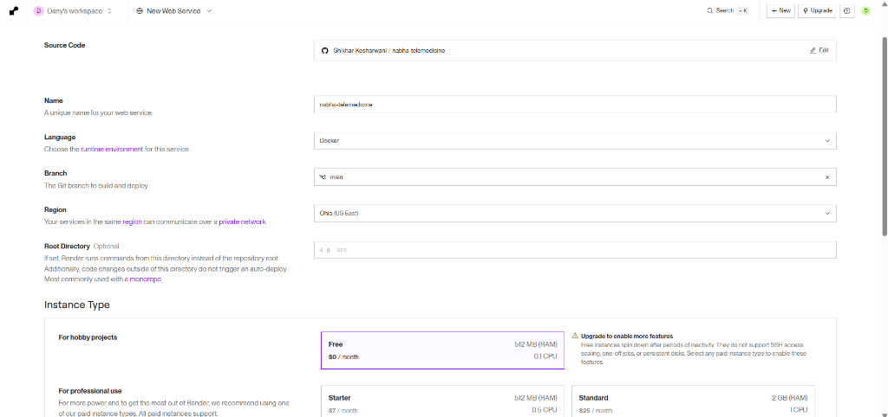
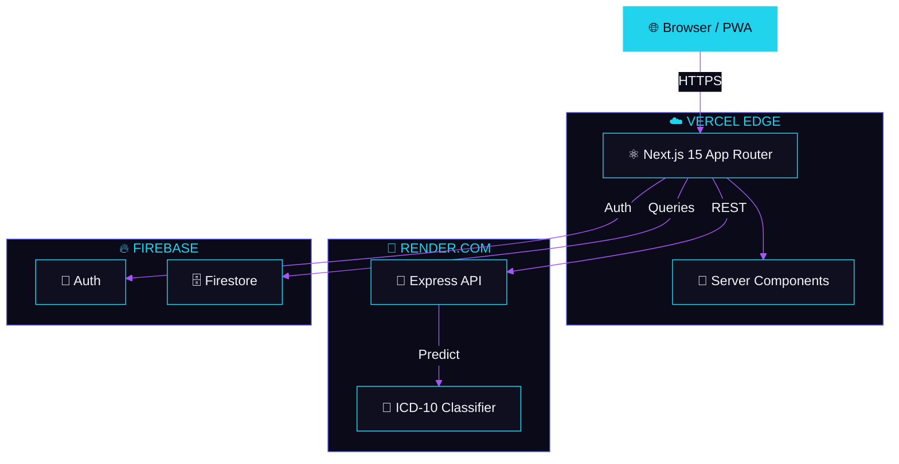
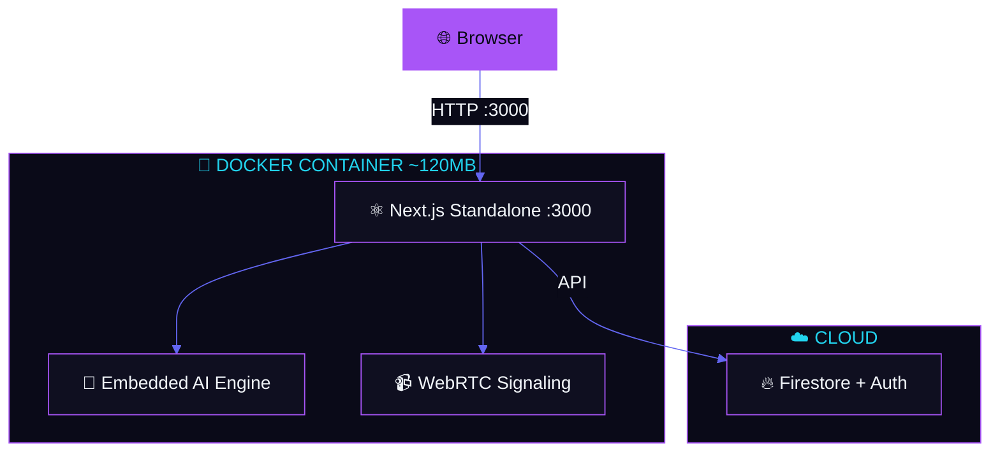
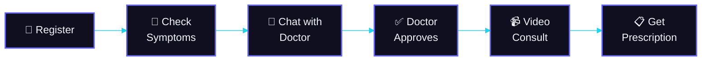

<!-- palette: #22d3ee (clinical teal), #6366f1 (deep indigo), #a855f7 (violet), #0a0a18 (dark navy) | theme: clinical-dark-3d healthcare -->

<div align="center">

<!-- ═══════════════════════════════════════════════════════════════════ -->
<!-- HERO SECTION — Official Nabha Platform Graphic Banner -->
<!-- ═══════════════════════════════════════════════════════════════════ -->



<br/>

<!-- Animated typing tagline -->
<a href="https://github.com/Shikhar-Kesharwani/nabha-telemedicine">
  
</a>

<br/>

<a href="https://github.com/Shikhar-Kesharwani/nabha-telemedicine">
  
</a>

<br/><br/>

<!-- ═══════════════════════ BADGE CONSTELLATION ═══════════════════════ -->

<!-- Row 1: Core tech badges with custom colors -->
<a href="https://nextjs.org"></a>

<a href="https://typescriptlang.org"></a>

<a href="https://firebase.google.com"></a>

<a href="https://docker.com"></a>

<br/><br/>

<!-- Row 2: Status badges -->
[](https://github.com/Shikhar-Kesharwani/nabha-telemedicine/commits/main)
[](https://github.com/Shikhar-Kesharwani/nabha-telemedicine/actions/workflows/lint.yml)
[](https://github.com/Shikhar-Kesharwani/nabha-telemedicine/actions/workflows/test.yml)
[](https://github.com/Shikhar-Kesharwani/nabha-telemedicine/actions/workflows/security.yml)
[](https://github.com/Shikhar-Kesharwani/nabha-telemedicine)
[](https://github.com/Shikhar-Kesharwani/nabha-telemedicine)

<br/>

<!-- Row 3: Platform feature pills -->


</div>

<br/>

<!-- ═══════════════════════════════════════════════════════════════════ -->
<!-- VISUAL DIVIDER -->
<!-- ═══════════════════════════════════════════════════════════════════ -->


<br/>

<!-- ═══════════════════════════════════════════════════════════════════ -->
<!-- TABLE OF CONTENTS — Styled as a visual card -->
<!-- ═══════════════════════════════════════════════════════════════════ -->

<div align="center">

### 🧭 Navigate

[`🔭 Overview`](#-overview)
[`✨ Features`](#-key-features)
[`🧬 Tech Stack`](#-tech-stack)
[`🏗️ Architecture`](#-architecture)
[`🚀 Quick Start`](#-getting-started)
[`⚙️ Config`](#-environment-variables)
[`📖 Usage`](#-usage)
[`📁 Structure`](#-project-structure)
[`🔌 API`](#-api-reference)
[`🐳 Docker`](#-docker-deployment)
[`🧪 CI/CD`](#-testing--cicd)
[`🗺️ Roadmap`](#-roadmap)
[`🤝 Contributing`](#-contributing)
[`📄 License`](#-license)

</div>

<br/>


<br/>

## 🔭 Overview

<table>
<tr>
<td>

**Nabha Telemedicine** is a full-stack healthcare platform purpose-built for underserved and rural communities where specialist access is limited or nonexistent.

Patients describe symptoms in plain language and receive **AI-powered differential diagnoses mapped to ICD-10 codes**. They chat with doctors, share prescriptions and medical files, and — only after the doctor reviews and grants clinical authorization — connect via **peer-to-peer encrypted video or voice calls**.

The entire platform runs on a **zero-cost infrastructure** (Vercel + Render + Firebase Spark) and ships as a **Progressive Web App** installable on any device. A fully **Dockerized deployment** (~120MB Alpine container) is included for self-hosted or on-premise environments.

</td>
</tr>
</table>

<br/>


<br/>

## ✨ Key Features

<!-- ═══════════════ FEATURE SHOWCASE — Visual grid layout ═══════════════ -->

<div align="center">

<table>
<tr>
<td align="center" width="25%">


**AI Symptom Checker**

ICD-10 mapped differential diagnoses with confidence scores, urgency levels, and specialist routing

</td>
<td align="center" width="25%">


**Video Consultations**

WebRTC peer-to-peer encrypted video calls with STUN signaling — no third-party servers

</td>
<td align="center" width="25%">


**Clinical Authorization**

Doctors must review symptoms and grant permission before patients can request calls

</td>
<td align="center" width="25%">


**Progressive Web App**

Install on any device, works offline, native-like experience with service workers

</td>
</tr>
</table>

</div>

<br/>

<details>
<summary><strong>🔽 View All Features</strong></summary>
<br/>

<table>
<tr>
<td width="50%">

**🩺 Clinical Workflow**
- 🧠 AI symptom analysis → ICD-10 differential diagnoses
- 💬 Real-time doctor-patient chat
- 📎 Prescription & medical file sharing
- 🔒 Pre-consultation authorization gate
- 🟢 Live doctor presence heartbeat tracking
- 🗣️ Voice command navigation (Web Speech API)

</td>
<td width="50%">

**🏥 Health Services**
- 📅 Appointment booking (calendar + time slots + payments)
- 📋 Health records vault (upload/view documents)
- 💊 Medicine search & subscription tracking
- 🏪 Nearby pharmacy locator
- 🚑 Emergency ambulance finder
- 🌍 Multi-language support (i18next)

</td>
</tr>
<tr>
<td width="50%">

**👨‍⚕️ Doctor Portal**
- 📊 Dedicated doctor dashboard
- 👥 Patient queue management
- ✅ Grant/revoke call permissions per patient
- 📹 Accept video calls from authorized patients
- 📞 Accept voice calls from authorized patients

</td>
<td width="50%">

**⚡ Platform & Infrastructure**
- 🌙 Dark-first glassmorphic UI
- 🎬 Framer Motion page animations
- 📊 Recharts health analytics
- 🐳 Docker container (~120MB Alpine)
- ☁️ Zero-cost cloud deployment
- 🔄 Dual architecture support

</td>
</tr>
</table>

</details>

<br/>


<br/>

## 🧬 Tech Stack

<div align="center">

<!-- Skill icons grid -->
<a href="#tech-stack">
  
</a>

<br/><br/>

<!-- Secondary tools -->
<a href="#tech-stack">
  
</a>

</div>

<br/>

<details>
<summary><strong>🔽 Detailed Stack Breakdown</strong></summary>
<br/>

<div align="center">

| | Layer | Technology | Version | Purpose |
| :---: | :--- | :--- | :---: | :--- |
|  | **Frontend** | Next.js (App Router) | `15.3.8` | SSR/SSG with React Server Components |
|  | **UI Library** | React | `18.3` | Component-based rendering |
|  | **Language** | TypeScript | `5.x` | Type-safe full-stack development |
|  | **Styling** | Tailwind CSS | `3.4` | Utility-first CSS framework |
|  | **Components** | Radix UI / Shadcn | — | 35+ accessible primitives |
|  | **Animation** | Framer Motion | `11.x` | Page transitions & micro-animations |
|  | **Auth** | Firebase Auth | `12.x` | Email/password authentication |
|  | **Database** | Cloud Firestore | — | Real-time NoSQL document database |
|  | **Backend** | Express.js | `4.19` | AI API microservice |
|  | **Calls** | WebRTC + BroadcastChannel | — | P2P video/voice with tab-local signaling |
|  | **PWA** | next-pwa | `10.x` | Offline support & installability |
|  | **Container** | Docker (Alpine) | — | ~120MB multi-stage production build |
|  | **Hosting** | Vercel + Render | — | Zero-cost serverless deployment |

</div>

</details>

<br/>


<br/>

## 🏗️ Architecture

<div align="center">


</div>

<br/>

### ⚡ Architecture 1 — Decoupled Cloud

> Frontend on Vercel Edge · Backend on Render · Data on Firebase



<br/>

### 🐳 Architecture 2 — Dockerized Self-Hosted

> Everything in a single ~120MB Alpine container



<div align="center">

| | Architecture 1 | Architecture 2 |
| :--- | :---: | :---: |
| **Best For** | Production SaaS | Self-hosted / On-premise |
| **Frontend** | Vercel Edge CDN | Docker container |
| **AI Engine** | Render microservice | Embedded in container |
| **SSL** | Automatic (Vercel) | Nginx + Let's Encrypt |
| **Scaling** | Serverless auto-scale | VM / container scaling |
| **Monthly Cost** | **$0** | **$0** (+ server cost) |

</div>

<br/>


<br/>

## 🚀 Getting Started

### Prerequisites

<div align="center">

| Tool | Version | Verify | Required |
| :---: | :---: | :--- | :---: |
|  Node.js | `≥ 20.x` | `node -v` | ✅ |
|  npm | `≥ 10.x` | `npm -v` | ✅ |
|  Git | Any | `git --version` | ✅ |
|  Docker | `≥ 24.x` | `docker -v` | Optional |

</div>

### ⚡ Quick Install

```bash
# 1️⃣ Clone the repository
git clone https://github.com/Shikhar-Kesharwani/nabha-telemedicine.git
cd nabha-telemedicine

# 2️⃣ Install all dependencies
npm install
cd backend && npm install && cd ..

# 3️⃣ Configure environment
cp .env.example .env.local
# ✏️ Edit .env.local with your Firebase keys (see table below)

# 4️⃣ Launch development server
npm run dev
```

> **🟢 App running at `http://localhost:3000`**

<details>
<summary><strong>🔽 Optional: Start Backend AI API Separately</strong></summary>

```bash
cd backend
PORT=5001 npm start

# ✅ Health check:  http://localhost:5001/api/health
# 🧠 AI endpoint:  http://localhost:5001/api/ai/predict
```

</details>

<br/>


<br/>

## ⚙️ Environment Variables

Create `.env.local` in the project root:

<div align="center">

| Variable | Description | Required |
| :--- | :--- | :---: |
| `NEXT_PUBLIC_FIREBASE_API_KEY` | Firebase project API key | ✅ |
| `NEXT_PUBLIC_FIREBASE_AUTH_DOMAIN` | Firebase auth domain | ✅ |
| `NEXT_PUBLIC_FIREBASE_PROJECT_ID` | Firebase project ID | ✅ |
| `NEXT_PUBLIC_FIREBASE_STORAGE_BUCKET` | Firebase storage bucket | ✅ |
| `NEXT_PUBLIC_FIREBASE_MESSAGING_SENDER_ID` | Messaging sender ID | ✅ |
| `NEXT_PUBLIC_FIREBASE_APP_ID` | Firebase app ID | ✅ |
| `NEXT_PUBLIC_RENDER_BACKEND_URL` | Render backend URL | ❌ |

</div>

> **Note:** If `NEXT_PUBLIC_RENDER_BACKEND_URL` is not set, the symptom checker automatically falls back to the embedded local AI model.

<br/>


<br/>

## 📖 Usage

### 🏥 Patient Journey

<div align="center">



</div>

<table>
<tr>
<td width="50%">

**👤 Patient Flow**

1. **Register/Login** — Email + password auth
2. **Symptom Check** — Describe symptoms → AI diagnoses
3. **Chat** — Message doctor, share files & prescriptions
4. **Request Call** — Unlocked only after doctor approval
5. **Video/Voice Call** — P2P encrypted WebRTC
6. **Records** — Upload & manage medical documents

</td>
<td width="50%">

**👨‍⚕️ Doctor Flow**

1. **Login** — Access `/doctor/dashboard`
2. **Review Queue** — See incoming patient requests
3. **Chat** — Read symptoms, view shared files
4. **Authorize** — Click "Grant Call Permission"
5. **Accept Call** — Handle video/voice consultations
6. **Prescribe** — Share treatment plans via chat

</td>
</tr>
</table>

<br/>


<br/>

## 📁 Project Structure

```
nabha-telemedicine/
│
├── 🌐 src/app/                        # Next.js App Router
│   ├── (app)/                         # Patient authenticated routes
│   │   ├── dashboard/                 #   ├── 📊 Dashboard (vitals, charts)
│   │   ├── appointments/              #   ├── 📅 Booking flow
│   │   ├── doctor-chat/[doctorId]/    #   ├── 💬 Chat + file sharing
│   │   ├── video-call/[doctorId]/     #   ├── 📹 WebRTC video
│   │   ├── voice-call/[doctorId]/     #   ├── 📞 WebRTC voice
│   │   ├── symptom-checker/           #   ├── 🧠 AI diagnostics
│   │   ├── health-records/            #   ├── 📋 Document vault
│   │   ├── medicine-finder/           #   ├── 💊 Drug search
│   │   ├── pharmacy-locator/          #   ├── 🏪 Nearby pharmacies
│   │   └── ambulance-nearby/          #   └── 🚑 Emergency services
│   │
│   ├── doctor/                        # Doctor portal
│   │   ├── dashboard/                 #   ├── 👨‍⚕️ Queue + permissions
│   │   ├── video-call/[patientId]/    #   ├── 📹 Doctor video
│   │   └── voice-call/[patientId]/    #   └── 📞 Doctor voice
│   │
│   └── api/health/                    # Health check endpoint
│
├── 🧩 src/components/
│   ├── ui/                            # 35 Shadcn/Radix primitives
│   ├── voice-command-button.tsx       # Speech recognition nav
│   └── doctor-call-modal.tsx          # Call request modal
│
├── 📚 src/lib/
│   ├── services/                      # Domain service layer
│   │   ├── doctor-presence.ts         #   ├── 🟢 Heartbeat tracking
│   │   ├── call-permissions.ts        #   ├── 🔐 Auth gate
│   │   ├── call-signaling.ts          #   ├── 📡 WebRTC signaling
│   │   ├── chat.ts                    #   ├── 💬 Messaging
│   │   └── appointments.ts            #   └── 📅 Bookings
│   ├── firebase.ts                    # Firebase SDK init
│   └── i18n.ts                        # Internationalization
│
├── 🚀 backend/
│   ├── server.js                      # Express API + AI classifier
│   ├── Dockerfile                     # Backend container
│   └── render.yaml                    # Render deployment spec
│
├── 🐳 Dockerfile                      # Multi-stage production build
├── 🐳 docker-compose.yml              # Container orchestration
└── ⚙️ next.config.ts                  # Next.js + PWA config
```

<br/>


<br/>

## 🔌 API Reference

### Backend Express API

<div align="center">

| Method | Endpoint | Description |
| :---: | :--- | :--- |
| `GET` | `/api/health` | 🟢 Service health check |
| `POST` | `/api/ai/predict` | 🧠 AI symptom analysis |

</div>

<details>
<summary><strong>🔽 POST <code>/api/ai/predict</code> — Full Example</strong></summary>

**Request:**
```json
{
  "symptoms": "chest pain and shortness of breath"
}
```

**Response:**
```json
{
  "urgency": "Immediate Medical Attention",
  "specialistType": "Cardiologist",
  "differentialDiagnoses": [
    {
      "condition": "Acute Coronary Syndrome / Angina Pectoris",
      "confidencePercentage": 98,
      "explanation": "Symptom vector matches acute myocardial ischemia...",
      "icdCode": "I20.9"
    },
    {
      "condition": "Essential Primary Hypertension",
      "confidencePercentage": 45,
      "explanation": "Vascular pressure indicators consistent with stage 1...",
      "icdCode": "I10"
    }
  ],
  "homeRemedies": [
    "Sit upright and rest immediately",
    "Call 108 Emergency Ambulance",
    "Avoid any physical exertion"
  ],
  "disclaimer": "Generated by Dataset-Trained Medical AI Classifier (ICD-10 Mapped)."
}
```

</details>

<br/>


<br/>

## 🐳 Docker Deployment

<table>
<tr>
<td width="50%">

### Option A — Docker Compose

```bash
git clone https://github.com/Shikhar-Kesharwani/nabha-telemedicine.git
cd nabha-telemedicine

# Build and launch
docker-compose up -d --build

# Verify
docker-compose ps
docker-compose logs -f
```

</td>
<td width="50%">

### Option B — Direct Build

```bash
# Build image
docker build -t nabha-telemedicine:latest .

# Run container
docker run -d \
  --name nabha_app \
  -p 3000:3000 \
  --restart unless-stopped \
  -e NODE_ENV=production \
  nabha-telemedicine:latest
```

</td>
</tr>
</table>

<div align="center">

| Container Detail | Value |
| :--- | :--- |
| 📦 Base Image | `node:20-alpine` |
| 📐 Image Size | ~120MB |
| 👤 Runtime User | `nextjs` (UID 1001, non-root) |
| 🔍 Health Check | Every 30s via `wget` |
| 🔄 Restart Policy | `unless-stopped` |

</div>

<br/>


<br/>

## 🧪 Testing & CI/CD

<div align="center">

| Workflow | Badge | Trigger |
| :--- | :---: | :--- |
| 🔍 Lint | [](https://github.com/Shikhar-Kesharwani/nabha-telemedicine/actions/workflows/lint.yml) | Push / PR |
| 🧪 Tests | [](https://github.com/Shikhar-Kesharwani/nabha-telemedicine/actions/workflows/test.yml) | Push / PR |
| 🛡️ Security | [](https://github.com/Shikhar-Kesharwani/nabha-telemedicine/actions/workflows/security.yml) | Push / PR |
| 🚀 Deploy Vercel | [](https://github.com/Shikhar-Kesharwani/nabha-telemedicine/actions/workflows/deploy-vercel.yml) | Push to `main` |
| 📦 Release | [](https://github.com/Shikhar-Kesharwani/nabha-telemedicine/actions/workflows/release.yml) | Tag push |

</div>

```bash
# Run locally
npm run lint          # ESLint
npx tsc --noEmit      # Type check
npm run build         # Production build
```

<br/>


<br/>

## 🗺️ Roadmap

<div align="center">

| Status | Feature | Priority |
| :---: | :--- | :---: |
| ✅ | AI symptom checker with ICD-10 mapping | 🔴 |
| ✅ | Real-time doctor-patient chat + file sharing | 🔴 |
| ✅ | Pre-consultation authorization workflow | 🔴 |
| ✅ | WebRTC video and voice calls | 🔴 |
| ✅ | Doctor presence heartbeat tracking | 🟡 |
| ✅ | PWA support (installable, offline) | 🟡 |
| ✅ | Dual deployment (Cloud + Docker) | 🟡 |
| ⬜ | End-to-end encryption for chat | 🔴 |
| ⬜ | Push notifications (appointment reminders) | 🟡 |
| ⬜ | Hindi & Punjabi UI translations | 🟡 |
| ⬜ | ABHA / Ayushman Bharat integration | 🟢 |
| ⬜ | Razorpay payment gateway | 🟢 |

</div>

<br/>


<br/>

## 🤝 Contributing

Contributions are welcome! Here's how:

```bash
# 1. Fork the repo
# 2. Create your branch
git checkout -b feature/amazing-feature

# 3. Commit changes
git commit -m "feat: add amazing feature"

# 4. Push and open a PR
git push origin feature/amazing-feature
```

> **⚠️ Warning:** Never commit `.env` files or Firebase API keys. GitHub Secret Scanning is enabled and will block pushes containing exposed secrets.

<br/>

## 📄 License

<!-- TODO: Add a LICENSE file to the repository -->

This project is available for use. See the repository for details.

<br/>

## 📬 Contact

<div align="center">

**Shikhar Kesharwani** — Project Maintainer

[](https://github.com/Shikhar-Kesharwani)
[](https://github.com/Shikhar-Kesharwani/nabha-telemedicine)

</div>

<br/>

<!-- ═══════════════════════════════════════════════════════════════════ -->
<!-- FOOTER -->
<!-- ═══════════════════════════════════════════════════════════════════ -->


<div align="center">

<a href="https://github.com/Shikhar-Kesharwani/nabha-telemedicine">
  
</a>

<br/><br/>

<sub>Built with 💜 for communities that need healthcare the most.</sub>

<br/>

<a href="https://github.com/Shikhar-Kesharwani/nabha-telemedicine">
  
</a>
<a href="https://github.com/Shikhar-Kesharwani/nabha-telemedicine/fork">
  
</a>

</div>
